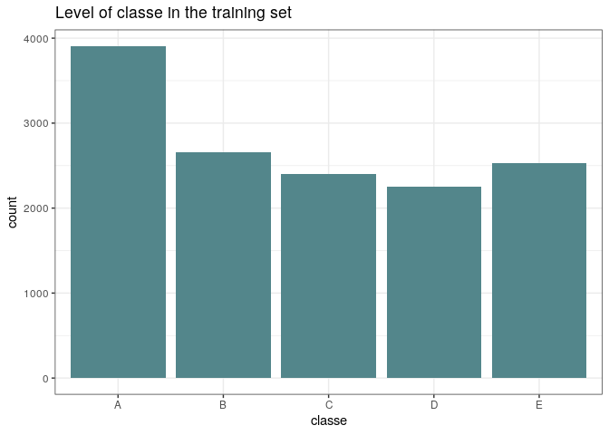
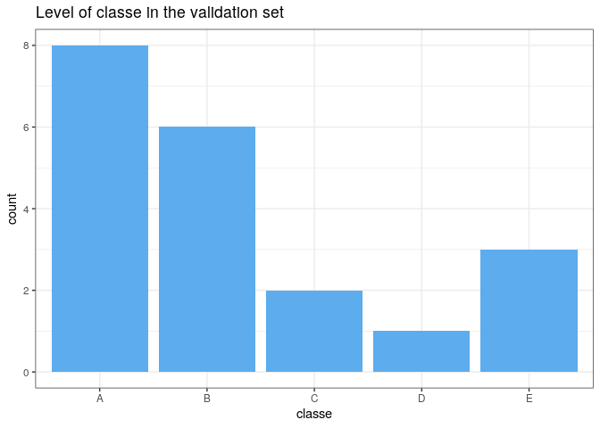

Human Activity Recognition – Predict Classe
================
<br>

[Overview](#overview) | [Analysis](#analysis) | [Modeling](#modeling) | [Testing](#testing) | [Conclusions](#summary) | [References](#refs)


# <a name="overview" />Overview

In this project, we’ll develop a model to predict a discrete variable
“classe” (ranking) based on other variables present in the [Weight
Lifting Exercises dataset](http://groupware.les.inf.puc-rio.br/har),
which ranks an activity performed by the wearer (from A – “best” to E –
“worst”). The data was collected from from accelerometers on the belt,
forearm, arm, and dumbbell of 6 participants.

# <a name="analysis" />Analysis

## Setup

``` r
library(tidyverse)
library(randomForest)
library(caret)

set.seed(1234)

trainData <- read.csv(
    "https://d396qusza40orc.cloudfront.net/predmachlearn/pml-training.csv", 
    na.strings = c("NA","#DIV/0!", "")
)
testData <- read.csv(
    "https://d396qusza40orc.cloudfront.net/predmachlearn/pml-testing.csv", 
    na.strings = c("NA","#DIV/0!", "")
)
```

## Subsets

``` r
inTrain <- createDataPartition(trainData$classe, p = 0.7, list = FALSE)
training <- trainData[inTrain,]
testing <- trainData[-inTrain,]
dim(training)
```

    ## [1] 13737   160

``` r
dim(testing)
```

    ## [1] 5885  160

## Clean the Data

``` r
clear <- grep("name|timestamp|window|X", colnames(training), value = FALSE)
training <- training[, -clear]
testing <- testing[, -clear]
NAs <- apply(
    training, 2, function(x) {sum(is.na(x))}
) / nrow(training)
training <- training[!(NAs > 0.95)] # Remove cols with NA > 95%
testing <- testing[!(NAs > 0.95)]

ncol(training)
```

    ## [1] 53

``` r
ncol(testing)
```

    ## [1] 53

## EDA

``` r
ggplot(training, aes(classe)) + 
    geom_histogram(stat = "count", fill = "cadetblue4") + 
    theme_bw() +
    labs(title = "Level of classe in the training set")
```

<!-- -->

# <a name="modeling" />Modeling

## PCA

``` r
preProcess(training[,1:ncol(training)], method = "pca", thresh = .95)
```

    ## Created from 13737 samples and 53 variables
    ## 
    ## Pre-processing:
    ##   - centered (52)
    ##   - ignored (1)
    ##   - principal component signal extraction (52)
    ##   - scaled (52)
    ## 
    ## PCA needed 25 components to capture 95 percent of the variance

``` r
preProc <- preProcess(training[,1:ncol(training)], method = "pca", pcaComp = 27)
trainingPC <- predict(preProc, training[, 1:ncol(training)])
head(trainingPC, n = 2)
```

    ##   classe      PC1      PC2       PC3       PC4       PC5      PC6          PC7
    ## 3      A 4.425266 1.439456 -2.775815 0.9514055 -1.310811 2.043208 0.0312237725
    ## 4      A 4.438582 1.430809 -2.762103 0.9501759 -1.323269 2.082081 0.0008583549
    ##         PC8         PC9       PC10       PC11       PC12      PC13      PC14
    ## 3 -2.700589 -0.03271874 -0.3308666 -0.6617390 -0.8723470 -2.923883 0.3886697
    ## 4 -2.670248 -0.01097895 -0.3414545 -0.6689946 -0.8989382 -2.919804 0.4325733
    ##         PC15     PC16       PC17       PC18     PC19      PC20       PC21
    ## 3 -0.2093927 0.881036 -0.5865502 -0.5204097 1.363620 0.2704740 -0.3018875
    ## 4 -0.1684467 0.872226 -0.5553130 -0.5072015 1.365982 0.2813342 -0.2528745
    ##         PC22      PC23       PC24       PC25      PC26       PC27
    ## 3 -0.3873182 0.4712228 -0.1628445 -0.4474671 0.1545298 -0.9329739
    ## 4 -0.3596439 0.5060033 -0.1812285 -0.4550846 0.1521804 -0.9164032

## Random Forest

``` r
modFit1 <- randomForest(training$classe ~ ., data = trainingPC)
array(importance(modFit1))
```

    ##  [1] 575.4724 420.5294 490.3419 347.4600 518.0102 418.9309 370.9428 675.1525
    ##  [9] 495.6565 367.2143 321.0507 556.5517 343.3897 624.8260 458.6529 397.2179
    ## [17] 398.3030 274.3657 295.6218 341.4198 369.4509 396.0182 199.1385 262.3734
    ## [25] 381.9601 292.8443 266.7516

# <a name="testing" />Cross-validation (Testing)

``` r
testingPC <- predict(preProc, testing[, 1:length(testing)])
confusionMatrix(testing$classe, predict(modFit1, testingPC))$overall
```

    ##       Accuracy          Kappa  AccuracyLower  AccuracyUpper   AccuracyNull 
    ##   9.780799e-01   9.722715e-01   9.740083e-01   9.816673e-01   2.844520e-01 
    ## AccuracyPValue  McnemarPValue 
    ##   0.000000e+00   5.476829e-06

## Validation

``` r
validation <- testData[, -clear]
validation <- validation[!(NAs > 0.95)]
validationPC <- predict(preProc, validation[, 1:length(validation)])
validation$classe <- predict(modFit1, validationPC)
```

# <a name="summary" />Conclusions

The overall conclusions for the observations are:

- 5885 out of 13737 observations were used 

- Out of 160 variables, 53 were useful for modeling 

- The model has a 97.5% overall accuracy 

- Sensitivity is between 94.5% - 99.2% 

- Specificity is between 98.9% -99.7%

### Detailed Statistics

``` r
confusionMatrix(testing$classe, predict(modFit1, testingPC))$byClass
```

    ##          Sensitivity Specificity Pos Pred Value Neg Pred Value Precision
    ## Class: A   0.9922342   0.9969128      0.9922342      0.9969128 0.9922342
    ## Class: B   0.9721497   0.9953547      0.9806848      0.9932575 0.9806848
    ## Class: C   0.9359095   0.9931592      0.9678363      0.9860054 0.9678363
    ## Class: D   0.9860515   0.9909146      0.9533195      0.9973583 0.9533195
    ## Class: E   0.9971936   0.9966777      0.9852126      0.9993754 0.9852126
    ##             Recall        F1 Prevalence Detection Rate Detection Prevalence
    ## Class: A 0.9922342 0.9922342  0.2844520      0.2822430            0.2844520
    ## Class: B 0.9721497 0.9763986  0.1952421      0.1898046            0.1935429
    ## Class: C 0.9359095 0.9516052  0.1802889      0.1687341            0.1743415
    ## Class: D 0.9860515 0.9694093  0.1583687      0.1561597            0.1638063
    ## Class: E 0.9971936 0.9911669  0.1816483      0.1811385            0.1838573
    ##          Balanced Accuracy
    ## Class: A         0.9945735
    ## Class: B         0.9837522
    ## Class: C         0.9645344
    ## Class: D         0.9884830
    ## Class: E         0.9969357

### Final Outcome

``` r
validation$classe
```

    ##  [1] B A C A A E D B A A A C B A E E A B B B
    ## Levels: A B C D E

``` r
ggplot(validation, aes(classe)) + geom_histogram(stat = "count", fill = "steelblue2") + theme_bw() +
    labs(title = "Level of classe in the validation set")
```

<!-- -->

## <a name="refs" />External References

<i>Ugulino, W.; Cardador, D.; Vega, K.; Velloso, E.; Milidiu, R.; Fuks,
H. Wearable Computing: Accelerometers’ Data Classification of Body
Postures and Movements. Proceedings of 21st Brazilian Symposium on
Artificial Intelligence. Advances in Artificial Intelligence - SBIA
2012. In: Lecture Notes in Computer Science. , pp. 52-61. Curitiba, PR:
Springer Berlin / Heidelberg, 2012. ISBN 978-3-642-34458-9. DOI:
10.1007/978-3-642-34459-6\_6. Cited by 2 (Google Scholar)</i>
